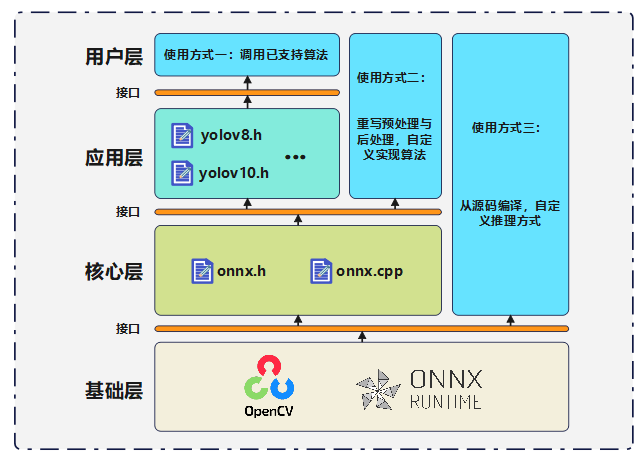
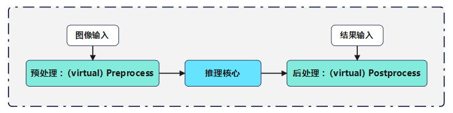

# onnxTool：深度学习onnxRuntime部署工具

一款C++编写的基于`OpenCV`和`onnxruntime`的深度学习部署工具

- 使用面向对象的封装方式，提供多层次接口，满足不同层次需求
- 支持图像的多batch推理
- 支持模型的多输出头推理

> [!IMPORTANT]
>
> 出于工程考虑，`OpenCV`与`onnxruntime`的运行库均需要独立引入与链接，提供一份`OpenCV`与`onnxruntime`的库文件供下载。[**OpenCV&onnxruntime(linux＋x64)**](https://github.com/superwuu/onnxTool/releases/tag/v3.0)
>
> `openCV`需支持dnn模块，参考版本为 **OpenCV-4.7.0**；`onnxrutime`参考版本为 **onnxruntime-1.20.1**

## 系统架构



### 1. 工具库层次说明

- **基础层**：`OpenCV`和`onnxruntime`运行库，本项目的基础部分，为上层结构提供接口实现
- **核心层**：`onnx.h`与`onnx.cpp`文件，基于基础层api，实现深度学习网络推理部分，为上层提供接口实现
- **应用层**：`code/*.h`文件，基于核心层api，提供一系列的深度学习算法实现，为用户提供对象实现

### 2.用户使用方式说明

- **方式一**：使用工具库中已经实现的深度学习算法，支持算法列表与使用方法见文档后续部分。

- **方式二**：工具库中未实现的深度学习算法，使用onnxTool工具实现推理，需使用核心层api，重写图像的预处理与后处理函数，使用方法见文档后续部分。

- **方式三**：从源码编译。对核心层部分进行自定义修改，可重构推理方式，使用方法见文档后续部分。


## 工具库使用方法

#### 方式一：使用已支持算法

用法参考`examples`文件夹下的实现方式

```c++
#include "algo.h"	// 引入应用层api	需根据code文件夹下具体算法进行修改 e.g "yolov10.h"

以yolov10为例：
// api1：构建推理对象
// 1.1: inputImages:需要推理图像的vector ---- modelPath:onnx文件路径 ---- thresholdconfidence:推理置信度
	Yolov10(std::vector<cv::Mat> inputImages, std::string modelPath, float thresholdconfidence);
// 1.2:modelPath:onnx文件路径
	Yolov10(std::string modelPath);

// api2:加载图像(用于1.2方式构建对象)
	// inputImages:需要推理图像的vector
	void SetBatchImgs(std::vector<cv::Mat> inputImages);

// api3：推理运行
	void Detection();

// api4：保存图像（可选）
// idx:推理图像vector中的下标 ---- save_path:图像结果保存路径
	void SavePic(int idx, std::string save_path);

// api5：输出推理结果（可选）
// 返回batch张图像的矩形框结果,每个矩形框格式未Otool::Info
	std::vector<std::vector<Otool::Info>> GetResult();

// Otool::Info:
struct Info {
    Info(cv::Rect rect, float confidence, int classId) :_rect(rect), _confidence(confidence), _classId(classId) {}
    cv::Rect _rect;		// 矩形框的Rect [x0,y0,w,h]
    float _confidence;	// 矩形框结果的置信度
    int _classId;		// 矩形框的类别分类
};
```

#### 方式二：自定义算法推理

用法参考`code`文件夹下的实现方式

核心层的推理流程如下：



当需要对自己的算法进行推理时，仅需重写预处理和后处理函数即可

- **预处理：**多个图像合成一张图像

- **后处理：**遍历batch_size每张图像，再遍历图像中的每个输出头。函数需要处理的是单个输出头（level_index）的单张图像（batch_index）

> [!NOTE]
>
> **预处理可不重写（提供默认方式），后处理一定要重写覆盖**

**预处理：**

```c++
// 预处理，输入为batchSize图像vector，输出blobImage的格式为[Batch, Channel, Height, Width]
// inputImages:需要推理图像的vector ---- blobImage:用于接受预处理结果
    virtual void Preprocess(const std::vector<cv::Mat>& inputImages, cv::Mat& blobImage);
// e.g 实现示例，若不重写Preprocess，则使用下述预处理方式
void Otool::OnnxTool::Preprocess(const std::vector<cv::Mat>& inputImages, cv::Mat& blobImage) {
    std::cout << "----Using default Preprocessing!----" << std::endl;
    std::vector<cv::Mat> middleImages;
    for (size_t i = 0; i < inputImages.size(); ++i) {
        cv::Mat img_m;
        inputImages[i].convertTo(img_m, CV_32F);   // 转float
        Letterbox(img_m, cv::Size(_modelWidth, _modelHeight));   // 填充并resize
        // Letterbox_lr(img_m, cv::Size(_modelWidth, _modelHeight));   // 填充并resize
        middleImages.push_back(img_m);
    }
    blobImage = cv::dnn::blobFromImages(middleImages, 1. / 255., cv::Size(_modelWidth, _modelHeight), cv::Scalar(0, 0, 0), false);
}
// Letterbox将原图像格式转换为推理格式，并进行填充。此函数使用的yolov5的图像填充方式
// Letterbox_lr功能同Letterbox。此函数使用的是yolox的图像填充方式
```

**后处理：**

```c++
// 后处理，输入为每张图像的推理结果的内存指针，输出这张图像的检测矩形框信息，通过resInfo返回，level_index是不同输出头的索引，batch_index是batch索引
    virtual void Postprocess(float* output, std::vector<Info>& resInfo, const int level_index, const int batch_index);
// 获取原图尺寸（在Letterbox中完成保存）
	int _iorigW = _origWidth[batch_index], iorigH = _origHeight[batch_index];
// 获取同比例缩放后图像尺寸（在Letterbox中完成保存）
	int _ipreW = _preWidth[batch_index], _ipreH = _preHeight[batch_index];
// 获取填充的像素信息（在Letterbox中完成保存）
	int _ipadW = _padWidth[batch_index], _ipadH = _padHeight[batch_index];
// 获取每个输出头的格式 e.g [3,80,40,40]
	std::vector<int64_t> _levelOutputShape = _outputTensorShape[level_index]
```

#### 方式三：从源码编译

 下载源码文件夹，通过下述方式进行编译：

`Linux` 系统命令如下 **（cmake＋make）**

```bash
# 创建build空间
mkdir build && cd build
# cmake构建
cmake ..
# make编译
make
# 安装,在源文件目录创建install放置
make install
```
`Windows` 系统命令如下 **（cmake＋msbuild）**

```bash
# 创建build空间
mkdir build && cd build
# cmake构建
cmake ..
# msbuild编译
msbuild .\onnxTool.vcxproj /p:Configuration=Release
# 安装,在源文件目录创建install放置
msbuild .\INSTALL.vcxproj /p:Configuration=Release
```

执行完成后，在源文件目录的install目录下出现`include`和`lib`两个目录，即onnxTool工具库。在工程中引入这两个目录即可

## 已支持算法

- yolov8【目标检测】
- yolov10【目标检测】
- Adaface【人脸检索】
- face-detector（yolo-face ＋ Adaface）【人脸识别】

## 参考

[**onnxruntime c++推理**](https://blog.csdn.net/qq_41822101/article/details/137688484)

[**yolov5的letterbox填充**](https://zhuanlan.zhihu.com/p/692080647)

[**OpenCV安装示例（linux && windows）**](https://blog.csdn.net/KRISNAT/article/details/122154491)
